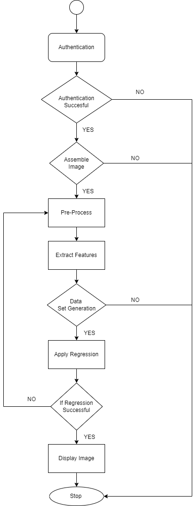

### Description
* The pattern-relationship is derived from a High Resolution (HR) image and its Low Resolution (LR) image and applying this relation on the interpolated Low Resolution image for converting it into a High Resolution image.

* We will use Active Sampling and Gaussian Process Regression algorithm to obtain a feature set and recognize pattern relationship respectively.

### Software Required

* **NET BEANS** 6.9.1 or higher.
* **JDK 1.6** or higher.
* **WEKA** Toolbar.

### Flow Diagram

